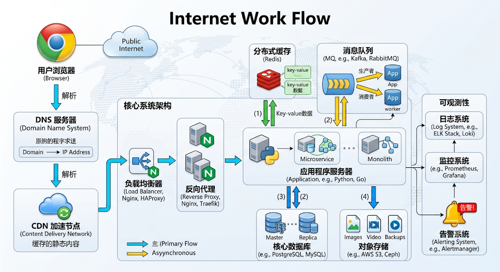
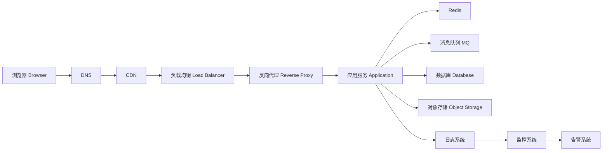
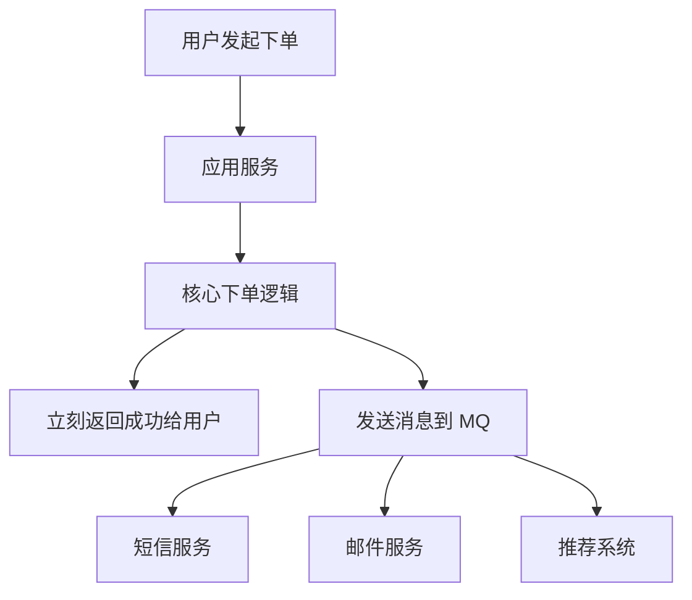

# 第一章：互联网到底是怎么工作的？🌐



## 先别急着背名词

很多人一看到互联网架构图，第一反应不是“我懂了”，而是：

> “救命，为什么一个打开网页的动作，后面跟着一串看起来像 RPG Boss 队列的名词？😵”

别慌，这很正常。

因为互联网这东西，表面上看起来像：

```text
我点一下网页 -> 页面出来了
```

实际上背后是：

```text
浏览器 -> DNS -> CDN -> 负载均衡 -> 反向代理 -> 应用服务
       -> Redis -> 消息队列 -> 数据库 -> 对象存储
       -> 日志 -> 监控 -> 告警
```

看着像一串黑话，但本质上它们都在干一件非常朴素的事情：

> 把一个用户请求，安全、快速、稳定地送到正确的程序那里，再把结果漂漂亮亮地送回来。🚚

所以这一章，我们不搞“概念轰炸”，我们搞“剧情推进”。

你可以把自己想象成一个普通用户，打开浏览器，输入：

```text
https://example.com/products/123
```

然后我们一路跟着这个请求，看看它到底经历了什么。

***

## 本章按三个问题来拆解

你的仓库首页提了三个特别好的问题，这一章就按这个思路来：

### 1. 为什么会出现这些技术？🤔

因为最原始、最天真、最“我先写出来再说”的方案，根本扛不住真实世界。

一个最朴素的网站长这样：

- 浏览器直接请求服务器
- 服务器直接查数据库
- 数据库返回结果
- 页面显示完毕

用户少的时候，这方案没毛病。

但流量一上来，问题会像开闸泄洪一样冲出来：

- 一台机器扛不住
- 所有人都来抢数据库
- 图片、CSS、JS 这种静态资源每次都回源，纯纯浪费
- 一个服务挂了，全站陪葬
- 一个下单请求顺便还要发短信、发邮件、写日志、通知库存，用户得等到天荒地老
- 出问题了你还不知道哪儿炸了

于是工程师只能开始“拆家”。

不是为了显得高级，而是因为：

> **复杂的问题，必须拆开处理。**

### 2. 为什么选这些技术？有没有别的选择？🧰

因为每一层都在处理一个具体问题。

不是为了堆技术栈，而是为了专业分工。

- DNS 负责“找地址”
- CDN 负责“把内容送近一点”
- 负载均衡负责“别都挤一台机器”
- 反向代理负责“统一入口和转发规则”
- 应用服务负责“真正的业务逻辑”
- Redis 负责“能快一点就快一点”
- MQ 负责“别什么都同步硬等”
- 数据库负责“重要数据必须稳”
- 对象存储负责“图片视频别往数据库里乱塞”
- 日志、监控、告警负责“出事了至少得知道”

它们像一支分工明确的团队：

- DNS 像通讯录 📒
- CDN 像离你最近的仓库 📦
- 负载均衡像分诊台 🏥
- 反向代理像写字楼前台 🧑‍💼
- Redis 像桌面便签 📝
- MQ 像待办传送带 🎢
- 数据库像总账本 📚
- 对象存储像大仓库 🏬
- 监控和告警像仪表盘加警报器 🚨

### 3. 它们到底怎么工作？怎么用？🔍

接下来我们就正式开始跟踪一个请求。

但在这之前，先看一眼全局图，不然容易“人还没上路，脑子先迷路”。

***

## 一张图先把全景记住



你现在不用每个词都懂。

只要先记住一句话：

> **这不是一台机器在打工，这是一个流水线在配合。**

***

## 一个请求的冒险故事 🎬

主角登场：

- 你：一个想看商品详情页的普通用户
- 浏览器：你雇来的跑腿小哥
- 后端系统：一整个忙得要命但又必须保持优雅的互联网工厂

你在浏览器里输入：

```text
https://example.com/products/123
```

回车一按，请求正式出发。

先给这位请求发一张“旅行路线图”：

```text
[你]
 |
 v
[浏览器]
 |
 v
[DNS] -> "先问路，找到地址"
 |
 v
[CDN] -> "静态资源能就近拿就别回老家"
 |
 v
[负载均衡] -> "别挤同一台机器"
 |
 v
[反向代理] -> "统一入口，按规则转发"
 |
 v
[应用服务] -> "真正开始处理业务"
 |   |    |    |
 |   |    |    +--> [对象存储]
 |   |    +-------> [数据库]
 |   +------------> [Redis]
 +----------------> [MQ]

后台还有：
[日志] -> [监控] -> [告警]
```

***

## 第 0 站：浏览器，互联网世界的跑腿总管 🏃

很多人以为浏览器只是“把网页显示出来”。

其实它远不止这个水平。

浏览器像一个全能助理，它会：

- 解析 URL
- 发起 HTTP / HTTPS 请求
- 管理 Cookie 和本地存储
- 缓存部分资源
- 执行 JavaScript
- 解析 HTML 和 CSS
- 最终把页面渲染出来

比如这个 URL：

```text
https://example.com/products/123?from=home
```

浏览器会先把它拆开：

- 协议：`https`
- 域名：`example.com`
- 路径：`/products/123`
- 查询参数：`from=home`

然后浏览器会发出灵魂拷问：

> “行，我知道你叫 `example.com`，但你到底住哪儿啊？👀”

于是，请求进入下一站：DNS。

***

## 第 1 站：DNS，不记 IP 的人类之光 📒

### 为什么需要 DNS？

互联网底层通信靠的是 IP 地址，比如：

```text
203.0.113.10
```

机器看到这串数字会很开心。

人类看到这串数字只会想：

> “谁家好人天天背 IP 啊？😑”

所以 DNS 出现了。

DNS 的核心工作就是：

> **把域名翻译成 IP 地址。**

像什么？

像你的手机通讯录：

- 你记住的是“张三”
- 手机真正拨打的是“138xxxxxx”

这里：

- 域名 = 联系人名字
- IP = 真实号码

### DNS 实际在做什么？

浏览器或操作系统会先看看自己有没有缓存。

如果有缓存，直接用，省时省力。

如果没有，就去问 DNS 服务器：

- `example.com` 对应哪个 IP？
- 这个结果能缓存多久？

最后拿到一个可访问的地址，请求才能继续往下走。

如果你更喜欢“看图秒懂”，DNS 可以先粗暴理解成这样：

```text
你在浏览器输入：
example.com
    |
    v
浏览器/操作系统先看本地缓存
    |
    |-- 有缓存 -------> 直接拿 IP
    |
    |-- 没缓存 -------> 去问 DNS 服务器
                           |
                           v
                    "example.com 对应谁？"
                           |
                           v
                     返回一个 IP 地址
                           |
                           v
                   浏览器拿着 IP 继续访问
```

### 为什么有时 DNS 解析出来不是应用服务器，而是 CDN？

因为很多网站上的内容，并不需要每次都跑回源站拿。

比如：

- 图片
- logo
- CSS
- JavaScript
- 视频封面

这类内容放在离用户更近的节点上更划算，所以 DNS 有时会先把你引导到 CDN。

### 如果没有 DNS 会怎样？

那互联网会立刻变成：

```text
“你好，请背诵 182.23.44.91 才能访问首页。”
```

这显然不太像一个正常世界。

***

## 第 2 站：CDN，专治“你离服务器太远” 📦

### 为什么需要 CDN？

假设你的源站在美国，但用户在杭州。

每次请求都跨大半个地球来回跑，速度当然慢得像在等鸽子送信。

这时候 CDN 就出手了。

CDN，全称 Content Delivery Network，内容分发网络。

它干的事情很像：

> **在很多地方提前放好“常用内容”的副本，让用户从最近的地方拿。**

### 你可以把 CDN 理解成什么？

像电商的多地仓库。

如果全国所有商品都只放在上海一个仓库：

- 北京用户慢
- 广州用户慢
- 成都用户也慢

那肯定不行。

更合理的方式是：

- 华北放一仓
- 华东放一仓
- 华南放一仓

谁离哪近，谁就从哪拿。

CDN 就是在互联网里做这件事。

### CDN 一般缓存什么？

通常是静态内容：

- 图片
- CSS
- JavaScript
- 视频片段
- 下载文件

有时也会缓存变化不频繁的接口结果，但这要更小心。

### 为什么动态请求通常不能一股脑丢给 CDN？

因为动态请求常常跟“当前用户的实时状态”有关：

- 你有没有登录
- 购物车里现在有什么
- 库存还剩多少
- 这张券还能不能用

这种内容如果乱缓存，分分钟会出现：

> “我怎么打开的是别人的购物车？” 😨

这显然会出大事。

### 用一张图看懂静态和动态

```text
静态资源：大家看起来都差不多
用户 A -> CDN -> 图片/logo/CSS/JS
用户 B -> CDN -> 图片/logo/CSS/JS

动态请求：每个人结果可能都不一样
用户 A -> 应用服务 -> 我的订单
用户 B -> 应用服务 -> 你的订单
```

### 没有 CDN 会怎样？

- 静态资源全部打回源站
- 用户离源站越远越慢
- 热门资源会把源站带宽打爆

简而言之：

> CDN 不制造内容，它只是让内容“更近、更快、更省源站”。⚡

***

## 第 3 站：负载均衡，别让一台服务器打满全场 🏥

### 为什么单机不行？

如果整个网站只有一台服务器，那它迟早会遇到经典三连：

- CPU 爆了
- 内存满了
- 带宽打穿了

最惨的是，它一挂，全站直接“陪它一起睡过去”。

所以工程上一定会把应用部署到多台机器上。

但多台机器也会带来一个新问题：

> “用户的请求，到底先打给谁？” 🤷

这就是负载均衡器存在的原因。

### 负载均衡到底在做什么？

它站在流量入口，负责把请求合理分发到后端多台机器。

像一个非常忙但非常冷静的分诊台：

- 这个请求给 1 号机器
- 下一个给 2 号机器
- 再下一个给 3 号机器
- 某台机器太忙了，就先别塞给它

### 常见分发策略

- 轮询：一个一个来
- 加权轮询：强一点的机器多干点
- 最少连接：谁空闲谁上
- Hash：让某些请求尽量固定落到某个节点

### 用图理解负载均衡

```text
用户请求
   |
   v
[Load Balancer]
   |----> App 1
   |----> App 2
   |----> App 3
```

### 为什么它很重要？

因为它直接影响三件大事：

- 能扛多少流量
- 某台机器挂了还能不能顶住
- 新机器能不能快速加入战场

换句话说，负载均衡是在说：

> “大家别挤，排队，一个一个来，我来安排。” 😎

常见实现：

- Nginx
- HAProxy
- 云厂商 Load Balancer

***

## 第 4 站：反向代理，互联网写字楼前台本人 🧑‍💼

很多人学到这里会开始皱眉：

> “等等，前面不是已经有负载均衡了吗？怎么又来了个反向代理？”

这个问题特别好。

因为它们确实都能“转发请求”，所以刚开始很容易混。

### 反向代理是干嘛的？

它通常站在应用服务前面，负责：

- 统一入口
- 路由转发
- HTTPS 证书处理
- 限流
- 安全过滤
- 某些静态资源处理
- 隐藏后端真实结构

### 它和负载均衡的区别

你可以这么记：

- **负载均衡**：更关心“分给谁”
- **反向代理**：更关心“怎么接、怎么转、怎么管”

现实里两者能力确实可能重叠。

有些时候一个组件两件事都干。

但从学习角度，把它们分开理解非常有帮助。

### 一个形象比喻

反向代理就像写字楼一楼前台：

- 访客只知道大楼地址
- 不知道 3 楼是产品部、5 楼是财务部、7 楼是技术部
- 前台看一眼来意，就把人带去正确的地方

用户眼里看到的是“一个统一入口”，后面怎么拆，其实并不需要知道。

### 反向代理常干的活

- `/api` 转给后端接口服务
- `/static` 转给静态资源目录
- 处理 HTTPS
- 拦截一些恶意请求
- 做灰度发布或 A/B 测试

常见实现：

- Nginx
- Traefik
- Envoy

***

## 第 5 站：应用服务，终于轮到真正干活的人了 💻

前面的 DNS、CDN、负载均衡、反向代理，虽然都很重要，但它们都不知道你的业务到底要干嘛。

它们不知道：

- 这个用户有没有登录
- 库存够不够
- 优惠券还能不能用
- 订单是否合法
- 这个人有没有权限访问

这些事，只有应用服务懂。

### 应用服务通常在做什么？

一个典型请求到这里后，流程大概是：

1. 收到请求
2. 解析参数
3. 验证身份
4. 校验权限
5. 执行业务逻辑
6. 查 Redis 或数据库
7. 需要异步任务时发消息给 MQ
8. 记录日志
9. 返回响应

### 单体应用和微服务怎么理解？

图里有两种形态：

- 单体应用 `Monolith`
- 微服务 `Microservice`

#### 单体应用

所有业务写在一个项目里。

你可以先把它想成“一家公司所有人都挤在同一个大房间里办公”：

```text
+----------------------------------+
|           单体应用 Monolith        |
|----------------------------------|
| 用户模块 | 订单模块 | 库存模块      |
| 支付模块 | 管理后台 | 其他业务      |
+----------------------------------+
           |
           v
         一个整体部署
```

优点：

- 上手快
- 开发简单
- 调试方便

缺点：

- 业务越来越多时，项目会越来越重
- 改动影响面容易变大
- 扩展粒度不够细

#### 微服务

把用户、订单、库存、支付这些功能拆成独立服务。

而微服务更像“同一家公司拆成多个小办公室”：

```text
         [API Gateway / Reverse Proxy]
                    |
     +--------------+--------------+
     |              |              |
     v              v              v
 [用户服务]      [订单服务]      [库存服务]
     |              |              |
     +-------+------+-------+------+
             |              |
             v              v
          [支付服务]      [通知服务]
```

一句话记忆：

- 单体：一整个项目一起上班
- 微服务：拆成多个小队分别上班

优点：

- 可以按业务独立扩容
- 团队分工更清晰
- 某些场景下更灵活

缺点：

- 调用链更长
- 运维复杂度更高
- 分布式问题更多

### 给初学者一句真心话

别一上来就把微服务当成“高级玩家专属皮肤”。

很多时候：

> **单体不是落后，单体只是更适合早期。**

先把业务跑起来，再考虑怎么拆，通常才是更靠谱的成长路线。

***

## 第 6 站：Redis，速度焦虑终结者 ⚡

### 为什么不每次都查数据库？

因为数据库虽然可靠，但通常没内存快。

如果每个请求都疯狂打数据库，后果一般是：

- 响应越来越慢
- 连接数越来越高
- 热点数据被反复查
- 数据库压力越来越大

这个时候 Redis 就登场了。

Redis 本质上是一个高性能内存键值存储。

一句大白话：

> **数据库负责“稳”，Redis 负责“快”。**

### 可以把 Redis 理解成什么？

像你桌上的便签纸。

- 正式账本在档案室
- 你当然可以每次都跑去档案室翻
- 但如果有些信息你一天要看 800 次，你就会想先记在手边

数据库像总账本，Redis 像桌面便签。

### 最常见的使用方式

```text
先查 Redis
   |
   |-- 命中 -> 直接返回，爽
   |
   |-- 没命中 -> 查数据库 -> 把结果写回 Redis -> 返回
```

这就是常见的缓存旁路模式 `Cache Aside`。

再用一张“手绘路线图”记一下缓存命中和未命中：

```text
                [用户请求]
                    |
                    v
               [应用服务]
                    |
                    v
              "先查 Redis"
               /         \
              /           \
             v             v
        [命中 Hit]      [未命中 Miss]
             |             |
             v             v
         直接返回       去查数据库
                           |
                           v
                      查到结果后
                           |
                           v
                    回填 Redis 再返回
```

如果你想再更口语一点地记：

- 命中：哎呀，手边就有，直接给你
- 未命中：等下，我去档案室翻一下

### 为什么 Redis 不能直接代替数据库？

因为 Redis 虽然快，但数据库更擅长：

- 持久化
- 事务
- 复杂查询
- 结构化数据管理

所以千万别搞反：

> **缓存不是数据真相，数据库才是。**

***

## 第 7 站：MQ，别让用户等你把所有活都干完 🎢

很多新手最容易犯的错误之一，就是：

> “既然要做，那我就在这一次请求里全做完。”

听起来很努力。

实际上很容易把系统做成“用户等到怀疑人生”。

比如用户下单后，你还想顺手：

- 发短信
- 发邮件
- 推送通知
- 写行为日志
- 通知库存系统
- 更新推荐系统

如果这一切都同步做完，用户可能会想：

> “我只是点了个下单，怎么像在等银行审批贷款？😵‍💫”

### MQ 是干嘛的？

MQ，消息队列，是一个异步通道。

应用先把“待处理任务”塞进去，后面的消费者再慢慢干。

你可以把它理解成餐厅后厨的出单系统：

- 前台先收单
- 后厨按单做事
- 前台不用等所有菜炒完，才能接待下一位客人

### MQ 最擅长解决三类问题

- **异步**：先返回，再慢慢处理后续任务
- **解耦**：下单系统不用知道短信系统内部怎么实现
- **削峰**：流量瞬间很高时，先排队，别把后端直接挤爆

### 一张图看懂同步 vs 异步



### 但也别什么都往 MQ 里扔

如果一个动作本来就必须立刻完成，比如：

- 扣款必须真的成功
- 核心订单必须真的创建成功

那这类关键链路通常不能随便异步化。

不然业务语义就会开始“表面成功，背后翻车”。

常见实现：

- Kafka
- RabbitMQ
- RocketMQ

***

## 第 8 站：数据库，真正的总账本 📚

Redis 很快，MQ 很灵活，但到了最后，最关键的数据还是得落到数据库。

为什么？

因为数据库干的是这件事：

> **把重要数据长期、可靠、可查询地保存下来。**

比如：

- 用户是谁
- 谁买了什么
- 库存还有多少
- 钱到底有没有付成功

这类数据不能靠“差不多”“大概”“缓存里好像还有”来判断。

必须有一个最终可信的地方。

这个地方，就是数据库。

### 可以把数据库理解成什么？

像公司的总账本和档案室。

平时为了快，你可以看缓存；
为了做分析，你可以看报表；
但真要对账，最后还是得翻总账本。

### 主库和从库是什么？

图里画了 `Master` 和 `Replica`。

你也可以直接把它脑补成下面这张图：

```text
                写请求
                  |
                  v
            [主库 Master]
                  |
                  | 复制数据
        +---------+---------+
        |                   |
        v                   v
 [从库 Replica 1]    [从库 Replica 2]
        ^                   ^
        |                   |
        +------ 读请求 ------+
```

一句大白话：

- 写数据，通常先写主库
- 读数据，可以分一些给从库
- 从库是跟着主库“抄作业”的

你可以先这样理解：

- 主库：负责写入
- 从库：复制主库的数据，承担部分读取

为什么要这么做？

因为数据库也不是无限强。

当读取很多时，把一部分读请求分给从库，可以减轻主库压力。

但这里有个工程现实要记住：

> 主从复制通常不是绝对实时的。

也就是说，刚写完的数据，从库可能会慢半拍才同步过来。

这就是常说的复制延迟问题。

常见数据库：

- MySQL
- PostgreSQL

***

## 第 9 站：对象存储，别把大文件硬塞进数据库 🏬

很多人会问：

> “图片、视频、备份文件，不能也存数据库吗？”

答案是：能，但通常不优雅。

如果你把大量大文件塞进数据库，常见后果是：

- 数据库体积迅速膨胀
- 备份越来越慢
- 成本越来越高
- 读取和维护都不舒服

所以工程上通常会把文件内容放到对象存储里。

### 对象存储适合放什么？

- 图片
- 视频
- 音频
- 文档
- 备份文件

### 一个很好记的区别

- 数据库：更像结构化账本
- 对象存储：更像超大网盘或文件仓库

通常数据库里只存文件的元信息：

- 文件名
- 路径或 URL
- 大小
- 上传者
- 创建时间

真正的文件内容，放在对象存储里。

常见实现：

- AWS S3
- Ceph
- MinIO

***

## 第 10 站：日志、监控、告警，系统的“眼睛、仪表盘、警报器” 🚨

做到这里，很多初学者会松一口气：

> “功能终于写完了！”

但真实世界的工程师会说：

> “功能写完只是开始，上线之后才是真正的战场。” 😬

因为真正可怕的问题不是“功能没做出来”，而是：

- 慢了你不知道
- 报错了你不知道
- 数据不对你不知道
- 服务挂了你还是不知道

所以生产系统必须具备可观测性。

也就是：

> **系统出了问题，你得看得见。**

***

## 第 11 站：日志，事故发生后的第一现场记录 🧾

日志就是系统运行时写下来的“流水账”。

它会记录：

- 收到了什么请求
- 参数是什么
- 走了哪段逻辑
- 查了哪个数据库
- 哪一步报错了

你可以把日志理解成：

- 飞机黑匣子
- 操作流水
- 事故回放线索

很多线上问题，第一时间就是先翻日志。

常见日志系统：

- ELK
- Loki

日志最核心的价值：

- 排查错误
- 复盘事故
- 审计行为

***

## 第 12 站：监控，别等用户来骂你才知道系统慢了 📊

日志很重要，但日志更偏“细节记录”。

监控则更像“实时体检仪表盘”。

它会让你持续看到：

- CPU 高不高
- 内存满不满
- 接口快不快
- 错误率高不高
- 数据库连接是否异常

### 一个比喻

监控像开车时的仪表盘。

你不会每开 10 分钟就拆发动机看看里面零件还好吗。

你先看的是：

- 速度表
- 油量表
- 水温表

系统监控也是一样。

它先帮你用“指标”看整体状态。

常见实现：

- Prometheus
- Grafana

***

## 第 13 站：告警，别只会看盘，还得会喊人 📣

有监控还不够。

因为监控面板就算做得再炫，也不能保证有人 24 小时盯着看。

所以还需要告警系统。

它会在关键指标异常时主动通知人。

比如：

- 错误率超过 5%
- P99 延迟超过 1 秒
- 某服务实例全部下线
- 数据库磁盘快满了

然后通过：

- 飞书
- Slack
- 邮件
- 短信
- 电话

把值班同学叫起来。

你可以把这套东西理解成：

- 日志：发生了什么
- 监控：现在状态怎么样
- 告警：别看了，快起来处理

常见实现：

- Alertmanager

***

## 现在把整条链路一口气串起来 🧵

再来一遍，这次你应该会顺很多。

如果你喜欢“像地铁线路图一样”去记，也可以这么看：

```text
[用户]
  |
  v
[浏览器]
  |
  v
[DNS] ---> 找地址
  |
  v
[CDN] ---> 近一点拿静态资源
  |
  v
[负载均衡] ---> 分流
  |
  v
[反向代理] ---> 统一入口 / 路由
  |
  v
[应用服务]
  |------> [Redis]       快速拿热点数据
  |------> [数据库]      保存核心数据
  |------> [对象存储]    放图片/视频/文件
  |------> [MQ]          异步处理后续任务
  |
  v
[返回响应给浏览器]

后台持续做的事：
[日志] -> [监控] -> [告警]
```

```text
1. 用户在浏览器输入网址
2. 浏览器先解析 URL
3. DNS 帮忙把域名翻译成 IP
4. 如果是静态资源，可能先从 CDN 获取
5. 动态请求进入负载均衡器
6. 负载均衡挑一台后端机器接单
7. 反向代理按规则把请求送到正确应用
8. 应用服务开始执行业务逻辑
9. 热点数据优先查 Redis
10. 关键数据最终落数据库
11. 耗时任务通过 MQ 异步处理
12. 图片视频等文件从对象存储读取
13. 整个过程中写日志、采集监控
14. 指标异常时触发告警
15. 浏览器收到响应，把页面渲染出来
```

是不是突然就没那么神秘了？

因为说到底，这整条链路体现的就一句话：

> **每一层只干自己最擅长的事。**

***

## 为什么不把所有功能全塞进一个服务里？🧠

因为“能做”不代表“适合做”。

举几个典型例子：

- 应用服务也能做缓存，但 Redis 更擅长
- 数据库也能存文件，但对象存储更擅长
- 应用里也能自己做异步队列，但 MQ 更专业
- 程序也能直接写本地日志，但集中日志系统更方便搜和分析

工程设计的本质从来不是：

> “有没有办法硬做出来？”

而是：

> “怎样能以更低成本、更高稳定性、更好扩展性做出来？”

这才是现代互联网架构不断分层的根本原因。

***

## 这一章最重要的五个直觉 ✋

如果你读完只记住五件事，那请记住这五件：

### 1. 分层不是为了装酷，是为了活下去

系统越大，越不可能靠一个组件包打天下。

### 2. 快和稳，往往来自专业分工

CDN 负责近，Redis 负责快，数据库负责准，MQ 负责解耦和削峰。

### 3. 不是所有事情都该同步完成

同步链路越长，用户越容易等到烦躁。

### 4. 缓存不是最终真相

真正的核心数据，最后还是得看数据库。

### 5. 可观测性不是附属功能

没有日志、监控、告警，系统就像闭着眼开夜车。🌚

***

## 初学者最容易混淆的五组概念 🧩

### 1. 负载均衡 vs 反向代理

- 负载均衡：重点在“分发请求”
- 反向代理：重点在“统一入口和转发规则”

### 2. Redis vs 数据库

- Redis：追求快
- 数据库：追求可靠和结构化存储

### 3. MQ vs 数据库

- MQ：传递任务和事件
- 数据库：保存最终状态

### 4. 对象存储 vs 数据库

- 对象存储：放文件本体
- 数据库：放文件元信息和业务关系

### 5. 日志 vs 监控 vs 告警

- 日志：发生了什么
- 监控：现在怎么样
- 告警：快来处理

***

## 如果你想自己搭一个最小版本，该怎么学？🛠️

不用一上来就搞“大厂全家桶”。

更合理的路线通常是：

1. 先做一个单体 Web 应用
2. 让它能处理 HTTP 请求
3. 接一个关系型数据库
4. 再加 Redis 做缓存
5. 再用 Nginx 做反向代理
6. 再理解多实例和负载均衡
7. 再引入 MQ 处理异步任务
8. 最后补日志、监控、告警

这才是比较符合成长规律的学习路线。

不要一开始就被这些词吓住：

- Kubernetes
- 微服务
- 分布式系统
- Service Mesh

这些不是“新手村门口第一只怪”，它们更像后期副本。🎮

现代复杂系统，本质上都是从一个相对简单的系统慢慢演化出来的。

***

## 本章总结：互联网不是一台机器，而是一支剧组 🎭

现代互联网系统不是“某个超级服务器一个人单挑全场”。

它更像一支分工明确的剧组：

- 浏览器负责出发和展示
- DNS 负责找地址
- CDN 负责把静态内容送近一点
- 负载均衡负责分流
- 反向代理负责统一入口和路由
- 应用服务负责业务逻辑
- Redis 负责加速
- MQ 负责异步和削峰
- 数据库负责持久化
- 对象存储负责文件
- 日志、监控、告警负责让系统“看得见、管得住、救得回”

如果你把这一章真的吃透了，后面再学这些内容时，心里就不会再只有名词了：

- HTTP
- Linux
- Nginx
- Node.js / Python / Go
- MySQL / PostgreSQL
- Redis
- Docker
- Kubernetes
- AWS
- Distributed Systems

因为你已经知道：

> **它们不是零散知识点，它们是在解决互联网里的不同问题。**

***

## 下一章你可以继续追问的问题 🚀

1. 浏览器和服务器之间，HTTP 到底是怎么说话的？
2. HTTPS 到底为什么安全？证书又是个啥？
3. 一个请求到了 Linux 服务器之后，系统内部发生了什么？
4. Nginx 为什么能扛住那么多连接？
5. Redis 为什么会快得这么离谱？

如果这些问题继续一个个打通，你就不再只是“知道互联网名词”。

你会开始真正理解：

> **现代软件工程为什么会长成今天这个样子。**
