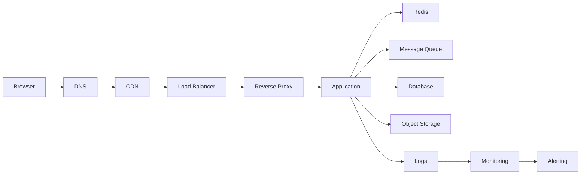
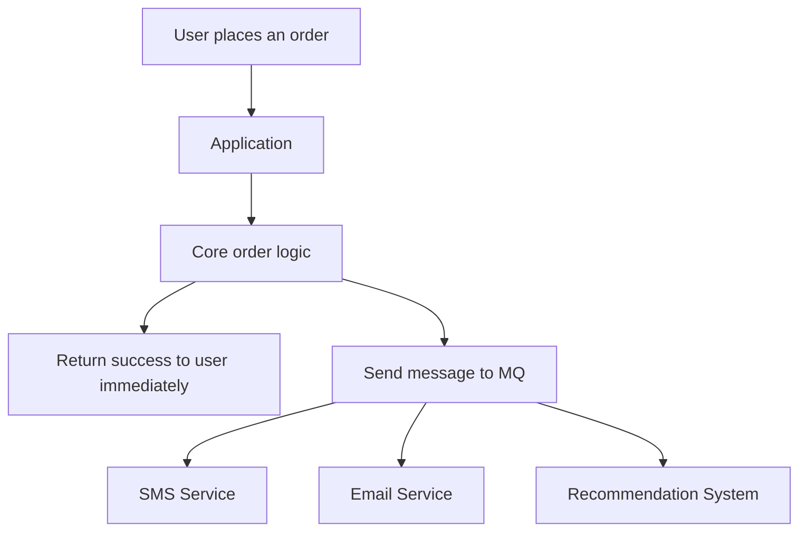

# Chapter 1: How Does the Internet Actually Work? 🌐


## Before We Panic Over Buzzwords

A lot of people look at an Internet architecture diagram and immediately think:

> "Why does opening one web page suddenly look like a boss fight with 12 system components? 😵"

Totally fair.

Because on the surface, the Internet feels like this:

```text
I click a page -> the page appears
```

But under the hood, it is more like this:

```text
Browser -> DNS -> CDN -> Load Balancer -> Reverse Proxy -> Application
        -> Redis -> Message Queue -> Database -> Object Storage
        -> Logs -> Monitoring -> Alerting
```

That looks like a lot of jargon, but all of it is trying to do one very ordinary thing:

> Take one user request, send it to the right place safely, quickly, and reliably, then send the result back nicely. 🚚

So in this chapter, we are not doing a dry definition dump.

We are doing a guided story.

Imagine you are a normal user. You open your browser and type:

```text
https://example.com/products/123
```

Then we follow that request step by step and see what really happens.

***

## This Chapter Follows Three Questions

The repository homepage asks three great questions, so this chapter follows that exact line of thinking:

### 1. Why do these technologies exist? 🤔

Because the most naive version of a website falls apart very quickly in the real world.

The simplest website looks like this:

- the browser sends a request
- one server handles everything
- that server reads the database
- the result goes back to the browser

At very small scale, this is fine.

But the moment traffic grows, problems show up like an avalanche:

- one machine cannot handle all requests
- everyone starts hammering the same database
- static files hit the origin every time and waste bandwidth
- one failure can take down the whole site
- one order request also tries to send emails, texts, logs, and downstream notifications all at once
- when something breaks, nobody knows where it broke

So engineers start breaking the problem apart.

Not to look fancy. Not to collect tools like Pokemon.

But because:

> **Complex problems need to be separated into smaller, specialized jobs.**

### 2. Why choose these technologies? Are there alternatives? 🧰

Because each layer solves one specific problem.

This is not about stacking tools for fun. It is about specialization.

- DNS is for finding addresses
- CDN is for bringing content closer
- load balancing is for not crushing one machine
- reverse proxy is for a unified entry and traffic rules
- application servers are for actual business logic
- Redis is for going fast when possible
- MQ is for not making everything synchronous
- databases are for storing important data safely
- object storage is for files that do not belong in the database
- logs, monitoring, and alerting are for knowing when the system is in trouble

They are like a team with clear roles:

- DNS is a contact list 📒
- CDN is a nearby warehouse 📦
- load balancer is a triage desk 🏥
- reverse proxy is the building front desk 🧑‍💼
- Redis is the sticky note on your desk 📝
- MQ is the conveyor belt for queued work 🎢
- database is the official ledger 📚
- object storage is the big warehouse 🏬
- monitoring and alerting are the dashboard and alarm 🚨

### 3. How do they actually work in practice? 🔍

That is the main event.

We are going to follow one request from the browser all the way through the system and ask:

- what each layer does
- why it exists
- what happens if it is missing
- how engineers usually use it

But first, let us get the full picture into our heads so we do not get lost halfway through.

***

## One Diagram To Hold The Whole Story



You do not need to fully understand every box yet.

Just remember one sentence:

> **This is not one machine doing everything. This is a pipeline of specialized workers cooperating.**

***

## The Adventure Of One Request 🎬

Meet the cast:

- you: a normal user trying to open a product page
- the browser: your overworked delivery assistant
- the backend: a very busy Internet factory trying to stay elegant under pressure

You type:

```text
https://example.com/products/123
```

You press Enter.

The request is officially on its way.

Here is its travel map:

```text
[You]
 |
 v
[Browser]
 |
 v
[DNS] -> "Find the address first"
 |
 v
[CDN] -> "If static content is nearby, do not go all the way back"
 |
 v
[Load Balancer] -> "Do not pile everything onto one machine"
 |
 v
[Reverse Proxy] -> "One entrypoint, rule-based forwarding"
 |
 v
[Application] -> "Now the real business work starts"
 |   |    |    |
 |   |    |    +--> [Object Storage]
 |   |    +-------> [Database]
 |   +------------> [Redis]
 +----------------> [MQ]

Also running in the background:
[Logs] -> [Monitoring] -> [Alerting]
```

***

## Stop 0: The Browser, Your Internet Errand Runner 🏃

Many beginners think the browser just "shows a page."

It does much more than that.

The browser is a multi-tool assistant that:

- parses the URL
- sends HTTP or HTTPS requests
- manages cookies and local storage
- caches some resources
- executes JavaScript
- parses HTML and CSS
- finally renders the page

For a URL like this:

```text
https://example.com/products/123?from=home
```

the browser breaks it down into:

- protocol: `https`
- domain: `example.com`
- path: `/products/123`
- query string: `from=home`

Then it asks the first real question:

> "Cool, I know your name is `example.com`, but where do you actually live? 👀"

That takes us to DNS.

***

## Stop 1: DNS, Humanity's Refusal To Memorize IP Addresses 📒

### Why do we need DNS?

Machines speak with IP addresses, such as:

```text
203.0.113.10
```

Machines love that.

Humans absolutely do not.

A human sees that number and thinks:

> "There is no way I am memorizing that every day. 😑"

So DNS exists.

Its job is simple:

> **Translate a human-friendly domain name into a machine-usable IP address.**

What is DNS like?

A phone contact list.

- you remember "Alice"
- your phone dials the real number

Here:

- domain name = contact name
- IP address = real phone number

### What does DNS actually do?

The browser or operating system first checks whether it already has a cached answer.

If it does, great. Fast path.

If not, it asks a DNS server:

- what IP address belongs to `example.com`?
- how long can I cache this answer?

After that, the browser finally has a real network destination.

If you like diagrams, here is a very rough but useful way to picture DNS:

```text
You type in the browser:
example.com
    |
    v
Browser / OS checks local cache
    |
    |-- cache hit --------> use the IP directly
    |
    |-- cache miss -------> ask a DNS server
                              |
                              v
                    "Who is example.com?"
                              |
                              v
                      returns an IP address
                              |
                              v
                browser continues with the request
```

### Why does DNS sometimes point to a CDN instead of the application server?

Because many resources do not need to come from the origin every single time.

Examples:

- images
- logos
- CSS
- JavaScript
- video thumbnails

If that content can be served from a node closer to the user, that is usually a better deal.

### What if DNS did not exist?

The Internet would become:

```text
"Welcome. Please memorize 182.23.44.91 to open the homepage."
```

Which is obviously not the timeline we want.

***

## Stop 2: CDN, The Fix For "Your Server Is Too Far Away" 📦

### Why do we need a CDN?

Imagine your origin server is in the US, but your user is in Hangzhou.

Every request has to travel a huge distance, and that makes things slower.

That is where the CDN steps in.

CDN stands for Content Delivery Network.

Its job is basically:

> **Keep copies of common content in many places so users can fetch it from somewhere closer.**

### What is a CDN like?

Think of an e-commerce company with warehouses in many cities.

If every package had to ship from one warehouse in one city:

- Beijing users wait longer
- Guangzhou users wait longer
- Chengdu users also wait longer

A smarter setup is to keep stock in multiple regions.

That is exactly the same idea on the Internet.

### What does a CDN usually cache?

Mostly static content:

- images
- CSS
- JavaScript
- video segments
- downloadable files

Sometimes it can also cache API responses that do not change often, but that requires more care.

### Why can we not just throw every dynamic request at the CDN?

Because dynamic requests often depend on real-time user-specific state:

- is this user logged in?
- what is in their cart right now?
- how much inventory is left?
- can this coupon still be used?

If you cache that carelessly, you get the nightmare scenario:

> "Why am I seeing somebody else's shopping cart?" 😨

That is a very bad day.

### Static vs dynamic in one quick picture

```text
Static content: mostly the same for everybody
User A -> CDN -> image / logo / CSS / JS
User B -> CDN -> image / logo / CSS / JS

Dynamic content: may differ for each user
User A -> Application -> my orders
User B -> Application -> your orders
```

### What happens without a CDN?

- static resources all hit the origin
- users far from the origin get worse latency
- hot content can overwhelm origin bandwidth

Short version:

> A CDN does not create content. It makes content closer, faster, and cheaper for the origin. ⚡

***

## Stop 3: Load Balancer, Please Do Not Melt One Server 🏥

### Why is one machine not enough?

If your whole site runs on one server, it eventually runs into the classic trio:

- CPU gets overwhelmed
- memory runs out
- bandwidth gets saturated

And if that one machine dies, the entire site goes down with it.

So in real engineering, applications are deployed on multiple machines.

That creates a new question:

> "Which machine should receive the next request?" 🤷

That is why the load balancer exists.

### What does the load balancer actually do?

It sits at the traffic entry point and distributes requests across multiple backend machines.

Think of it as a calm hospital triage desk:

- this request goes to server 1
- the next one goes to server 2
- the next one goes to server 3
- if one machine is too busy, stop shoving more work at it

### Common strategies

- round robin
- weighted round robin
- least connections
- hash or consistent hash

### One quick picture

```text
User requests
    |
    v
[Load Balancer]
    |----> App 1
    |----> App 2
    |----> App 3
```

### Why is this layer important?

Because it directly affects:

- throughput
- availability
- scalability

It is basically saying:

> "Everybody relax. I will organize the queue." 😎

Common implementations:

- Nginx
- HAProxy
- cloud load balancers

***

## Stop 4: Reverse Proxy, The Office Building Front Desk 🧑‍💼

A very common beginner question appears here:

> "Wait, we already have a load balancer. Why do we also need a reverse proxy?"

Excellent question.

Because they can both forward traffic, so the difference feels blurry at first.

### What does a reverse proxy do?

It usually sits in front of the application and handles:

- a unified entrypoint
- request routing
- HTTPS certificate handling
- rate limiting
- security filtering
- some static resource handling
- hiding backend topology

### How is it different from a load balancer?

A simple way to remember it:

- **load balancer** cares more about *who gets the traffic*
- **reverse proxy** cares more about *how requests are accepted, managed, and forwarded*

In real systems, these responsibilities can overlap.

Sometimes one product does both.

But for learning, separating the concepts helps a lot.

### A simple analogy

The reverse proxy is like the front desk in a large office building:

- visitors know the building address
- they do not know which floor each team sits on
- the front desk looks at the request and sends them to the right place

From the outside, users see one clean entrypoint.

### Common reverse proxy jobs

- route `/api` to backend services
- route `/static` to static assets
- terminate HTTPS
- block malicious requests
- support canary releases or A/B testing

Common implementations:

- Nginx
- Traefik
- Envoy

***

## Stop 5: The Application Server, Finally Someone Does The Real Work 💻

Everything before this point is important, but none of those layers actually understand your business.

They do not know:

- whether the user is logged in
- whether inventory is available
- whether the coupon is valid
- whether the order is legal
- whether the user has permission

Only the application knows that.

### What does an application server usually do?

A typical flow looks like this:

1. receive the request
2. parse parameters
3. verify identity
4. check permissions
5. run business logic
6. read Redis or the database
7. send messages to MQ if async work is needed
8. write logs
9. return the response

### How do monoliths and microservices fit in?

The diagram shows two common shapes:

- monolith
- microservices

#### Monolith

All business logic lives in one project.

You can picture it as "everyone in the company works in one giant room":

```text
+----------------------------------+
|          Monolith App             |
|----------------------------------|
| Users | Orders | Inventory       |
| Pay   | Admin  | Other features  |
+----------------------------------+
           |
           v
        one deployment unit
```

Pros:

- fast to start
- simple to develop
- easy to debug

Cons:

- it becomes heavy as the business grows
- changes can affect many areas
- scaling is less granular

#### Microservices

Split users, orders, inventory, payments, and so on into separate services.

This is more like "the same company split into multiple offices":

```text
        [API Gateway / Reverse Proxy]
                   |
    +--------------+--------------+
    |              |              |
    v              v              v
 [User Service] [Order Service] [Inventory Service]
    |              |              |
    +-------+------+-------+------+
            |              |
            v              v
     [Payment Service] [Notification Service]
```

Easy memory trick:

- monolith: one big team works in one project
- microservices: many smaller teams work in separate services

Pros:

- scale per business domain
- clearer team boundaries
- more flexibility in some scenarios

Cons:

- longer call chains
- higher operational complexity
- more distributed-system problems

### One honest note for beginners

Do not treat microservices as some magical "advanced player" badge.

Very often:

> **A monolith is not outdated. It is simply the better starting point.**

Get the business working first. Split later when the complexity actually earns it.

***

## Stop 6: Redis, The Cure For Speed Anxiety ⚡

### Why not read the database every single time?

Because databases are reliable, but memory is usually much faster.

If every request pounds the database directly, you usually get:

- slower responses
- more open connections
- repeated reads for hot data
- more pressure on the database

That is where Redis shows up.

Redis is a high-performance in-memory key-value store.

Very simple summary:

> **The database is for "correct and durable." Redis is for "fast right now."**

### What is Redis like?

Think of sticky notes on your desk.

- the official ledger is in the archive room
- yes, you could walk there every time
- but if you need the same information 800 times a day, you keep it near your hand

The database is the official ledger. Redis is the sticky note.

### The most common pattern

```text
Check Redis first
   |
   |-- hit -> return immediately, nice
   |
   |-- miss -> read the database -> write back to Redis -> return
```

This is the classic `Cache Aside` pattern.

Here is the same idea as a hand-drawn flow:

```text
                [User Request]
                     |
                     v
                [Application]
                     |
                     v
               "Check Redis first"
                /               \
               /                 \
              v                   v
         [Hit]                   [Miss]
          |                        |
          v                        v
   return immediately        query database
                                  |
                                  v
                           get the result
                                  |
                                  v
                      write back to Redis, then return
```

If you want the casual version:

- hit: great, I already have it right here
- miss: hang on, let me go check the archive room

### Why can Redis not replace the database?

Because Redis is fast, but databases are better at:

- persistence
- transactions
- complex queries
- structured data management

So do not mix this up:

> **Cache is not the source of truth. The database is.**

***

## Stop 7: MQ, Please Do Not Make The User Wait For Everything 🎢

One of the easiest beginner mistakes is:

> "If the system needs to do something, I will just do it all in this one request."

That sounds hardworking.

It also sounds like a great way to make users stare at loading spinners forever.

Imagine a user creates an order, and the system also wants to:

- send an email
- send an SMS
- push a notification
- write event logs
- notify inventory
- update recommendations

If all of that happens synchronously before the response returns, the user may think:

> "I just clicked Buy. Why does this feel like applying for a mortgage? 😵‍💫"

### What is MQ for?

MQ, or message queue, is an async channel.

The application drops work into the queue, and consumers handle it later.

You can think of it as the kitchen ticket rail in a restaurant:

- the cashier records the order
- the kitchen handles it in sequence
- the cashier does not need to wait for every dish to be cooked before taking the next customer

### The three big things MQ is good at

- **asynchrony**: return first, finish later
- **decoupling**: the order service does not need to know how the SMS service works internally
- **traffic smoothing**: when traffic spikes, queue it instead of crushing the downstream systems

### One picture for sync vs async



### But do not throw everything into MQ

Some operations really must finish in the critical path:

- the payment must actually succeed
- the core order must actually be created

If you make those fully asynchronous without thinking, you get a dangerous situation:

something looks successful on the surface, but the business state is actually broken underneath.

Common implementations:

- Kafka
- RabbitMQ
- RocketMQ

***

## Stop 8: The Database, The Real Ledger 📚

Redis is fast. MQ is flexible.

But in the end, your most important data still has to land in a database.

Why?

Because this is the database's core job:

> **Store important data durably, reliably, and queryably over time.**

For example:

- who the user is
- what they bought
- how much inventory is left
- whether money was actually paid

You cannot decide these things based on "well, I think the cache probably had it."

You need one trusted final place.

That place is the database.

### What is the database like?

Think of it as the company's official ledger and archive room.

For speed, you may look at the cache.
For analysis, you may look at reports.
But when it is time to reconcile reality, you open the ledger.

### What are primary and replicas?

The diagram shows `Master` and `Replica`.

You can picture it like this:

```text
                write requests
                     |
                     v
              [Primary / Master]
                     |
                     | replicate data
         +-----------+-----------+
         |                       |
         v                       v
    [Replica 1]             [Replica 2]
         ^                       ^
         |                       |
         +------ read requests --+
```

In plain English:

- writes usually go to the primary
- some reads can go to replicas
- replicas are basically copying homework from the primary

Why do this?

Because the database is not infinitely strong either.

If reads grow a lot, sending part of them to replicas reduces pressure on the primary.

But remember one important engineering reality:

> Replication is often not perfectly real-time.

So sometimes you write data, then a replica sees it a moment later.

That is the classic replication lag problem.

Common databases:

- MySQL
- PostgreSQL

***

## Stop 9: Object Storage, Please Stop Stuffing Huge Files Into The Database 🏬

A common question is:

> "Can we store images, videos, and backups in the database too?"

Technically yes.

Practically, usually not a great idea.

If you push lots of large files into the database, you often get:

- rapid database growth
- slower backups
- higher cost
- more awkward reads and maintenance

So in real systems, file content usually goes into object storage.

### What belongs in object storage?

- images
- videos
- audio
- documents
- backups

### One easy distinction

- database: structured records and relationships
- object storage: the actual file bodies

Usually the database stores metadata like:

- file name
- URL or path
- size
- uploader
- created time

The file content itself lives in object storage.

Common choices:

- AWS S3
- Ceph
- MinIO

***

## Stop 10: Logs, Monitoring, And Alerting, The Eyes, Dashboard, And Alarm 🚨

At this point, many beginners relax and think:

> "Nice, the feature works!"

Real engineers then say:

> "Cool. Now the hard part begins after deployment." 😬

Because the scary problems are not just "the feature was never built."

They are:

- the system is slow and nobody notices
- errors are happening and nobody notices
- data is wrong and nobody notices
- the service is down and somehow... nobody notices

That is why production systems need observability.

Which means:

> **When the system is in trouble, you need to be able to see it.**

***

## Stop 11: Logs, The First Crime Scene Notes 🧾

Logs are the system's written trail of what happened.

They record things like:

- what request arrived
- what parameters came in
- which code path ran
- which database query happened
- where an error occurred

You can think of logs as:

- a black box recorder
- an operation trail
- the first clues during incident investigation

Very often, the first step in debugging production is: open the logs.

Common logging systems:

- ELK
- Loki

The main value of logs:

- debugging
- incident review
- auditing

***

## Stop 12: Monitoring, Please Do Not Wait For Users To Complain 📊

Logs matter, but logs are mostly detailed records.

Monitoring is more like a live health dashboard.

It tells you things like:

- is CPU high?
- is memory filling up?
- are requests getting slower?
- is the error rate climbing?
- is the database connection pool in trouble?

### A simple analogy

Monitoring is like the dashboard in a car.

When you drive, you do not stop every 10 minutes and dismantle the engine to inspect every part.

You look at:

- the speedometer
- the fuel gauge
- the temperature gauge

System monitoring works the same way.

It helps you see the current state through metrics.

Common tools:

- Prometheus
- Grafana

***

## Stop 13: Alerting, Looking Is Not Enough, Somebody Has To Be Called 📣

Monitoring alone is not enough.

A dashboard can be beautiful, but that does not mean someone is staring at it 24/7.

So you also need alerting.

Alerting actively tells humans when key metrics become dangerous.

Examples:

- error rate above 5%
- P99 latency above 1 second
- all instances of a service are down
- the database disk is almost full

Then it notifies the on-call engineer through:

- Slack
- email
- SMS
- phone calls
- chat tools

You can summarize the three concepts like this:

- logs: what happened
- monitoring: how the system looks right now
- alerting: wake up, something is wrong

Common implementation:

- Alertmanager

***

## Now Let Us Run The Whole Chain Again 🧵

At this point, the story should feel a lot less mysterious.

If you like thinking in route maps, here is the whole thing again:

```text
[User]
  |
  v
[Browser]
  |
  v
[DNS] ------------> find the address
  |
  v
[CDN] ------------> get static content from somewhere closer
  |
  v
[Load Balancer] --> distribute traffic
  |
  v
[Reverse Proxy] --> one entrypoint / routing
  |
  v
[Application]
  |------> [Redis]         fast access to hot data
  |------> [Database]      durable core data
  |------> [Object Storage] files such as images and videos
  |------> [MQ]            async follow-up work
  |
  v
[Response goes back to the browser]

Always running in the background:
[Logs] -> [Monitoring] -> [Alerting]
```

And here is the same idea as a numbered flow:

```text
1. The user enters a URL in the browser
2. The browser parses the URL
3. DNS resolves the domain name into an IP
4. Static content may be served from a CDN
5. Dynamic requests go through the load balancer
6. The load balancer picks a backend machine
7. The reverse proxy routes the request by rules
8. The application runs business logic
9. Hot data may be read from Redis first
10. Important data is stored in the database
11. Slow follow-up work can be sent to MQ
12. Files such as images and videos may come from object storage
13. Logs and metrics are collected throughout the process
14. Alerts fire when metrics become abnormal
15. The browser receives the response and renders the page
```

At the end of the day, the whole chain is really about one idea:

> **Each layer should do the job it is best at.**

***

## Why Not Put Everything Into One Service? 🧠

Because "it can do it" is not the same as "it should do it."

Some very common examples:

- the application can cache data, but Redis is better at it
- the database can store files, but object storage is better at it
- the application can build its own retry queue, but MQ is better at it
- the program can write local log files, but centralized logging is better for search and analysis

Good engineering is not mainly about:

> "Can I somehow force this to work?"

It is about:

> "How do I make this work with lower cost, higher stability, and better scalability?"

That is why Internet architecture keeps becoming more layered.

***

## The Five Most Important Instincts From This Chapter ✋

If you only remember five things, remember these:

### 1. Layering is not for show, it is for survival

The larger the system gets, the less likely one component can do everything well.

### 2. Speed and stability often come from specialization

CDN is for closeness, Redis is for speed, the database is for correctness, MQ is for decoupling and traffic smoothing.

### 3. Not everything belongs on the synchronous path

The longer your critical path gets, the more users end up waiting.

### 4. Cache is not the final truth

For core data, the database still wins.

### 5. Observability is not optional

Without logs, monitoring, and alerting, running production is like driving at night with your eyes closed. 🌚

***

## Five Pairs Beginners Often Mix Up 🧩

### 1. Load Balancer vs Reverse Proxy

- load balancer: mainly about distributing traffic
- reverse proxy: mainly about unified entrypoints and forwarding rules

### 2. Redis vs Database

- Redis: optimized for speed
- database: optimized for reliability and structured storage

### 3. MQ vs Database

- MQ: passes tasks and events
- database: stores final state

### 4. Object Storage vs Database

- object storage: file bodies
- database: metadata and business relationships

### 5. Logs vs Monitoring vs Alerting

- logs: what happened
- monitoring: what is happening now
- alerting: somebody needs to act

***

## If You Want To Build The Smallest Working Version, How Should You Learn? 🛠️

You do not need the full big-tech architecture on day one.

A more realistic learning path is:

1. build a simple monolithic web app
2. make it handle HTTP requests
3. connect a relational database
4. add Redis for caching
5. use Nginx as a reverse proxy
6. learn multi-instance deployment and load balancing
7. add MQ for async jobs
8. finally add logs, monitoring, and alerting

That is a much more natural growth path.

Do not let these words scare you too early:

- Kubernetes
- microservices
- distributed systems
- service mesh

Those are not the "first monster outside the beginner village." They are more like later-game bosses. 🎮

Modern complex systems almost always evolve from simpler ones.

***

## Summary: The Internet Is Not One Super Server, It Is A Whole Film Crew 🎭

Modern Internet systems are not "one magical machine doing everything alone."

They are closer to a coordinated production crew:

- the browser starts the trip and renders the result
- DNS finds the address
- the CDN moves static content closer
- the load balancer spreads traffic
- the reverse proxy provides one entrypoint and routing
- the application handles business logic
- Redis speeds up hot reads
- MQ handles async and traffic spikes
- the database stores durable truth
- object storage keeps large files
- logs, monitoring, and alerting make the system visible, operable, and recoverable

If you truly understand this chain, the next topics become much easier:

- HTTP
- Linux
- Nginx
- Node.js / Python / Go
- MySQL / PostgreSQL
- Redis
- Docker
- Kubernetes
- AWS
- Distributed Systems

Because now you understand something much more important than the names:

> **These technologies are not random trivia. They each solve a different class of problem in real Internet systems.**

***

## Good Next Questions 🚀

1. How do browsers and servers actually talk over HTTP?
2. Why is HTTPS secure, and what is a certificate really doing?
3. What happens inside a Linux server after a request arrives?
4. Why can Nginx handle so many connections?
5. Why is Redis so ridiculously fast?

Once those questions start connecting together, modern Internet architecture stops feeling like magic and starts feeling like engineering.
